# TimingBar WinForms Demo (.NET 9)

Este repo demuestra cómo:
- Modelar los tiempos de un día (`TimingInfoHours`, dominio).
- Calcular layout en píxeles (`TimingBarCalculator`, aplicación).
- Renderizar una barra apilada en WinForms (UI).

## Estructura
- `src/Domain`: tipos de dominio (sin dependencia de UI).
- `src/Application`: cálculo de layout en píxeles.
- `src/WinFormsDemo`: app WinForms que dibuja la barra.
- `tests/*`: pruebas con xUnit.

## Build
```bash
dotnet build src/WinFormsDemo/WinFormsDemo.csproj
dotnet run --project src/WinFormsDemo/WinFormsDemo.csproj
```

# TimingInfoHours – Documentación y guía de implementación (.NET 9)

Barra vertical por día que muestra **Inicio**, **Trabajo** y **Fin**, con sub‑bandas **WK/TR/SP** y brackets laterales.
Este README define el **contrato de datos**, **invariantes**, **algoritmo de render**, ejemplos (C#/TS) y buenas prácticas.

---

## 🎯 Objetivo

Estandarizar cómo producimos (backend) y consumimos (frontend) la estructura **`TimingInfoHours`** para dibujar
la barra de tiempos de un día **sin ambigüedades ni cálculos duplicados**, respetando Clean Architecture, DDD y StyleCop.

---

## 🧩 Visión general

- **Bloques apilados** (de arriba a abajo):
  1) **Inicio** (`TimeInit`)
  2) **Trabajo** (`TimeWork`)
  3) **Fin** (`TimeEnd`)

- **Sub‑bandas** por bloque:
  - **WK** = Trabajo efectivo (**verde**)
  - **TR** = Transporte (**amarillo**)
  - **SP** = Parado (**rojo**)

- **Total del registro del día**: `TimeTotalReg`  
  Se usa para escalar horas→píxeles y para el **bracket** grande.

```mermaid
flowchart LR
  A["Backend (.NET 9)\nTimingCalculator/WorkService"] --> B["DTO TimingInfoHours (11 fields)\nJSON API"]
  B --> C["Front-end (React)\ncomputeTimingLayout(H, minBandPx)"]
  C --> D["SVG Render\nInit (SP+TR)\nWork (SP+WK+TR)\nEnd (SP+TR)"]
  D --> E["Brackets + Labels"]
```



---

## ✅ Invariantes (deben cumplirse siempre)

- `TimeInit  = TimeInitTR + TimeInitSP`
- `TimeWork  = TimeWorkWK + TimeWorkTR + TimeWorkSP`
- `TimeEnd   = TimeEndTR  + TimeEndSP`
- `TimeTotalReg = TimeInit + TimeWork + TimeEnd`

> Recomendado tolerancia numérica: `1e-6`.

---

## 📄 Contrato de datos

### C# (.NET 9)

```csharp
/// <summary>
/// Tiempos (horas) para dibujar la barra de un día.
/// Invariantes: TimeInit=TimeInitTR+TimeInitSP; TimeWork=TimeWorkWK+TimeWorkTR+TimeWorkSP;
/// TimeEnd=TimeEndTR+TimeEndSP; TimeTotalReg=TimeInit+TimeWork+TimeEnd.
/// </summary>
public sealed record TimingInfoHours
{
    // INICIO (bloque superior)
    public required double TimeInit { get; init; }     // Alto total bloque Inicio
    public required double TimeInitTR { get; init; }   // Sub-banda: Transporte (TR, amarillo)
    public required double TimeInitSP { get; init; }   // Sub-banda: Parado (SP, rojo)

    // TRABAJO (bloque medio)
    public required double TimeWork { get; init; }     // Alto total bloque Trabajo (bracket chico)
    public required double TimeWorkWK { get; init; }   // Sub-banda: Trabajo efectivo (WK, verde)
    public required double TimeWorkTR { get; init; }   // Sub-banda: Transporte (TR, amarillo)
    public required double TimeWorkSP { get; init; }   // Sub-banda: Parado (SP, rojo)

    // FIN (bloque inferior)
    public required double TimeEnd { get; init; }      // Alto total bloque Fin
    public required double TimeEndTR { get; init; }    // Sub-banda: Transporte (TR, amarillo)
    public required double TimeEndSP { get; init; }    // Sub-banda: Parado (SP, rojo)

    // TOTALES
    public required double TimeTotalReg { get; init; } // Total del día (bracket grande, denominador de escalado)
}
```

> **Unidades:** horas (h).  
> **Serialización JSON (ASP.NET Core):** usar `camelCase` (`JsonSerializerOptions.PropertyNamingPolicy = JsonNamingPolicy.CamelCase`).

### Ejemplo JSON (válido)

```json
{
  "timeInit": 1.0,
  "timeInitTR": 0.2,
  "timeInitSP": 0.8,

  "timeWork": 5.0,
  "timeWorkWK": 3.5,
  "timeWorkTR": 0.8,
  "timeWorkSP": 0.7,

  "timeEnd": 0.5,
  "timeEndTR": 0.1,
  "timeEndSP": 0.4,

  "timeTotalReg": 6.5
}
```

---

## 🧠 Semántica y uso en el gráfico

### Bloque: **Inicio** (tope de la barra)
- **`TimeInit`**: total desde el primer registro hasta WorkStart → alto del bloque superior.  
- **`TimeInitTR`**: transporte dentro de Inicio → sub‑banda **amarilla** (overlay).  
- **`TimeInitSP`**: parado dentro de Inicio → **fondo rojo**. (`TimeInitSP = TimeInit - TimeInitTR`).

### Bloque: **Trabajo** (centro)
- **`TimeWork`**: total entre WorkStart y WorkEnd → alto del bloque central + **bracket chico**.  
- **`TimeWorkWK`**: trabajo efectivo → **verde**.  
- **`TimeWorkTR`**: transporte dentro de la ventana de trabajo → **amarillo**.  
- **`TimeWorkSP`**: parado dentro de trabajo → **rojo**. (`TimeWorkSP = TimeWork - WK - TR`).

### Bloque: **Fin** (base de la barra)
- **`TimeEnd`**: total desde WorkEnd al último registro → alto del bloque inferior.  
- **`TimeEndTR`**: transporte en Fin → **amarillo** (overlay).  
- **`TimeEndSP`**: parado en Fin → **rojo**. (`TimeEndSP = TimeEnd - TimeEndTR`).

### Total del día
- **`TimeTotalReg`**: primer registro → último registro.  
  → **Denominador** de escalado horas→px y **bracket grande**.

---

---

## 📐 Regla de escalado (horas → píxeles)

```
pixels = AlturaTotalPx * (horas / TimeTotalReg)
```

### Procedimiento de dibujo (front)

1. Elegir `AlturaTotalPx` (p. ej. 320) y calcular:  
   ```
   scale = AlturaTotalPx / TimeTotalReg
   initH = round(TimeInit * scale)
   workH = round(TimeWork * scale)
   endH  = AlturaTotalPx - initH - workH   // cierra total exacto
   ```

2. Sub‑bandas (en cada bloque):  
   - **Inicio**: fondo rojo (`initSP`), overlay amarillo (`initTR`).  
   - **Trabajo**: fondo rojo (`workSP`), overlay verde (`workWK`), overlay amarillo (`workTR`).  
   - **Fin**: fondo rojo (`endSP`), overlay amarillo (`endTR`).

3. Posiciones Y (apilado):  
   ```
   yInit = 0
   yWork = yInit + initH
   yEnd  = yWork + workH
   ```

4. **Brackets**:  
   - **Grande**: `[0, AlturaTotalPx]` con `TimeTotalReg`.  
   - **Chico**: `[yWork, yWork + workH]` con `TimeWork`.

5. **Etiquetas internas** (opcional): solo si la sub‑banda ≥ 14 px.

---

## 🎨 Paleta de colores (sugerida)

| Sub‑banda | Color     |
|-----------|-----------|
| WK        | `#289028` |
| TR        | `#E6C828` |
| SP        | `#AA0000` |
| Borde     | `#000000` / `#888888` |
| Texto     | blanco/negro según contraste |

---

## 🧪 Validación recomendada

- Todos los campos **≥ 0** (con tolerancia `1e-6`).  
- Verificar todas las **invariantes**.  
- Si `TimeTotalReg == 0`, **no** dibujar la barra (mostrar “Sin datos”).  
- Para micro‑segmentos, puede aplicarse `minBandPx = 1..2` y compensar dentro del **mismo bloque**.

### Helper TS (front)

```ts
export type TimingInfoHours = {
  timeInit: number;   timeInitTR: number;   timeInitSP: number;
  timeWork: number;   timeWorkWK: number;   timeWorkTR: number;   timeWorkSP: number;
  timeEnd:  number;   timeEndTR:  number;   timeEndSP:  number;
  timeTotalReg: number;
};

export function isValidTiming(t: TimingInfoHours, tol = 1e-6): boolean {
  const near = (a: number, b: number) => Math.abs(a - b) <= tol;
  const nonNeg = Object.values(t).every(v => typeof v === 'number' && v >= -tol);

  return nonNeg
    && near(t.timeInit, t.timeInitTR + t.timeInitSP)
    && near(t.timeWork, t.timeWorkWK + t.timeWorkTR + t.timeWorkSP)
    && near(t.timeEnd,  t.timeEndTR  + t.timeEndSP)
    && near(t.timeTotalReg, t.timeInit + t.timeWork + t.timeEnd);
}
```

### Helper C# (layout en píxeles)

```csharp
public sealed record TimingLayout(
    int AlturaTotalPx,
    // Altos por bloque
    int InitH, int WorkH, int EndH,
    // Sub-bandas
    int InitTR, int InitSP,
    int WorkWK, int WorkTR, int WorkSP,
    int EndTR,  int EndSP,
    // Offsets
    int YInit, int YWork, int YEnd);

public static class TimingLayoutCalculator
{
    public static TimingLayout Compute(TimingInfoHours t, int alturaTotalPx)
    {
        if (t.TimeTotalReg <= 0 || alturaTotalPx <= 0)
            return new TimingLayout(0, 0, 0, 0, 0, 0, 0, 0, 0, 0, 0, 0, 0);

        var scale = alturaTotalPx / t.TimeTotalReg;

        int initH = (int)Math.Round(t.TimeInit * scale);
        int workH = (int)Math.Round(t.TimeWork * scale);
        int endH  = alturaTotalPx - initH - workH;

        int initTR = (int)Math.Floor(initH * (t.TimeInitTR / Math.Max(t.TimeInit, 1e-9)));
        int initSP = initH - initTR;

        int workWK = (int)Math.Floor(workH * (t.TimeWorkWK / Math.Max(t.TimeWork, 1e-9)));
        int workTR = (int)Math.Floor(workH * (t.TimeWorkTR / Math.Max(t.TimeWork, 1e-9)));
        int workSP = workH - workWK - workTR;

        int endTR = (int)Math.Floor(endH * (t.TimeEndTR / Math.Max(t.TimeEnd, 1e-9)));
        int endSP = endH - endTR;

        int yInit = 0;
        int yWork = yInit + initH;
        int yEnd  = yWork + workH;

        return new TimingLayout(alturaTotalPx,
            initH, workH, endH,
            initTR, initSP,
            workWK, workTR, workSP,
            endTR, endSP,
            yInit, yWork, yEnd);
    }
}
```

---

## 🧭 Troubleshooting

- **Barra vacía**: `TimeTotalReg = 0` → no renderizar (o mostrar “Sin datos”).  
- **Sub‑banda no visible**: por redondeo → aplicar `minBandPx` y compensar en el bloque.  
- **Etiquetas superpuestas**: mostrar texto solo si la altura ≥ 14 px.

---

## 📌 Notas de diseño

- Este DTO **no** codifica fechas/husos; sólo acumula **horas**. La zona horaria, si aplica, debe tratarse en dominio/infraestructura al persistir.  
- Mantener el README junto a la clase (`Domain/Work/Timing/TimingInfoHours.cs`).  
- Añadir XML‑Docs y habilitar StyleCop/analizadores en `Domain` para garantizar consistencia.
